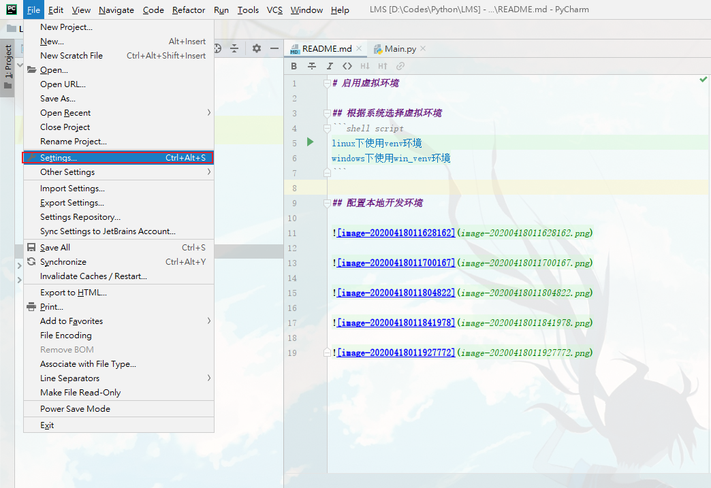
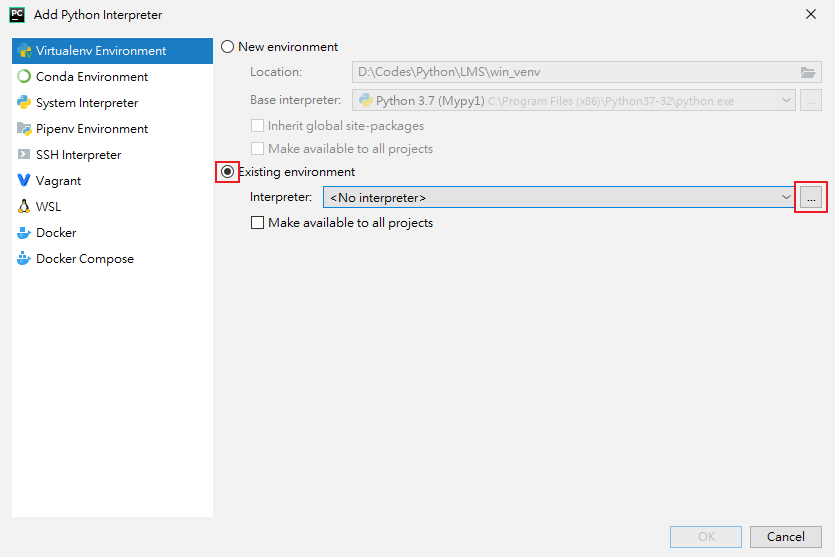
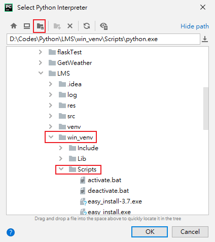
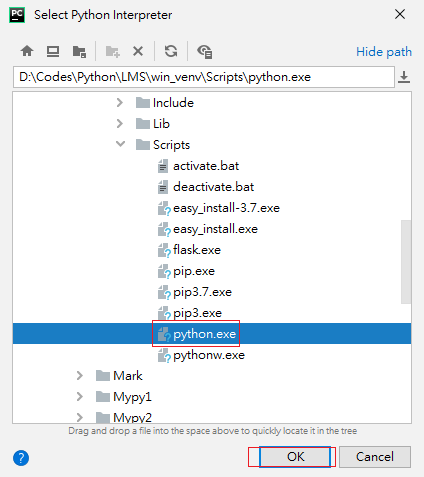
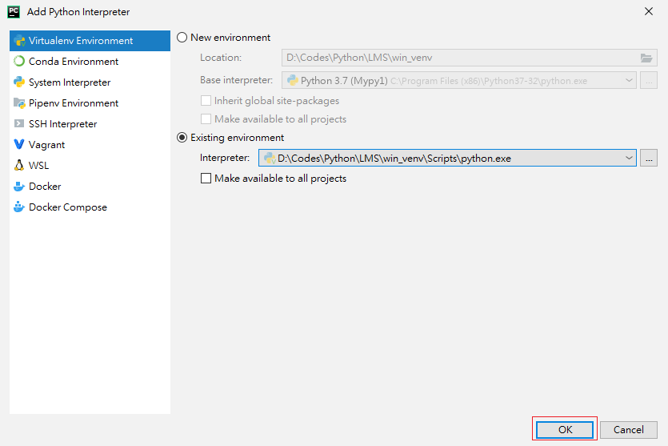
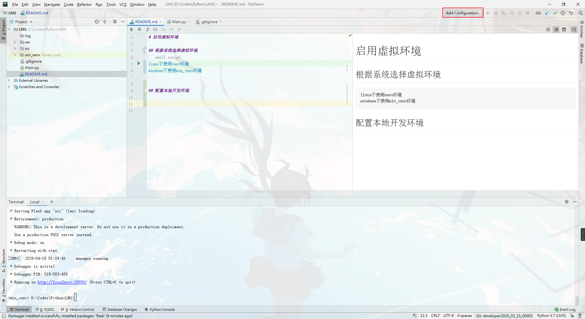
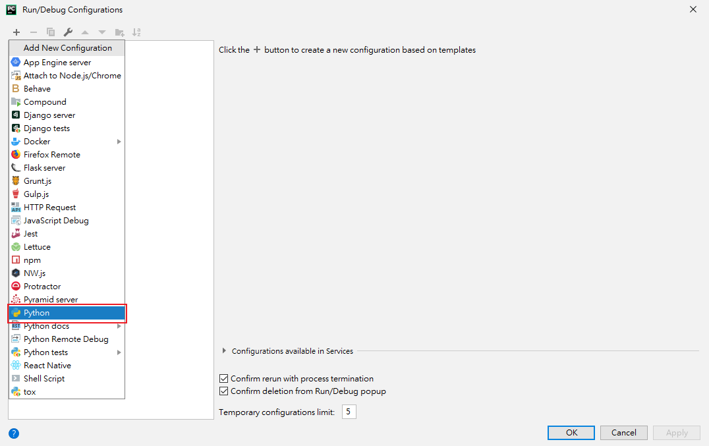
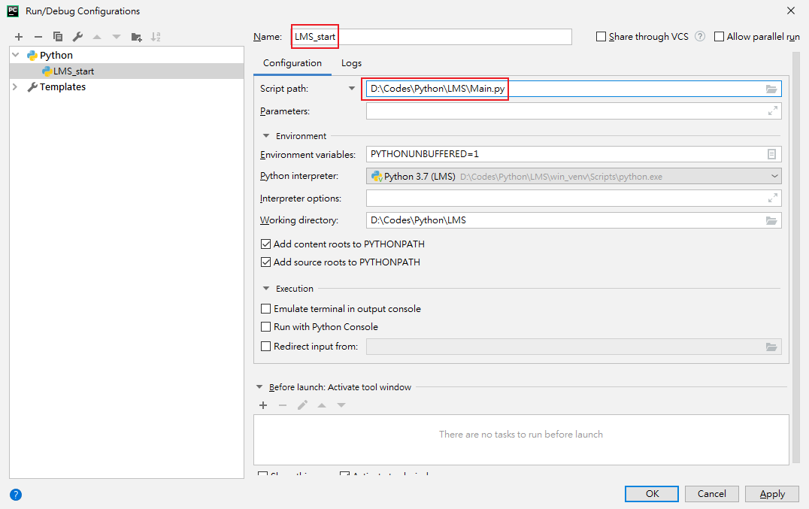
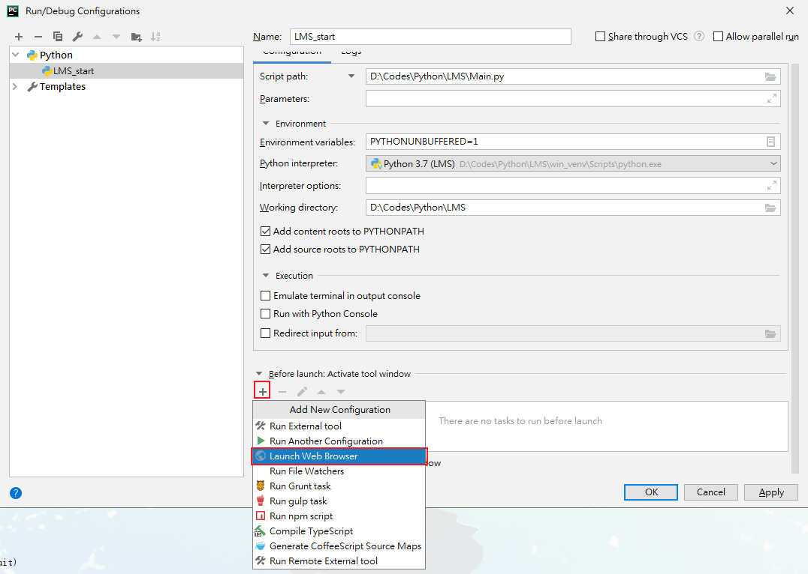
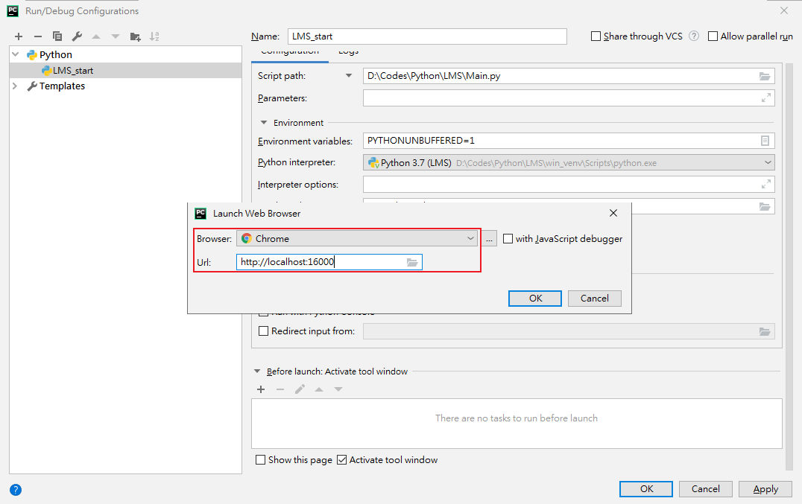

# 启用虚拟环境

## 根据系统选择虚拟环境
```
linux下使用venv环境
windows下使用win_venv环境

重要!!!:
提交时千万不要提交pyvenv.cfg文件，防止对他人环境造成干扰

windows下使用win_venv环境时需要更改文件夹下pyvenv.cfg文件
home = C:\Program Files (x86)\Python37-32改成你操作系统对应版本python的安装路径
version = 3.7.2改成你的python的版本号
```












## 配置本地开发环境











## 项目开发手册

### 文件介绍
```
该部分使用pychram查看源文件阅读查阅
├─log										    #日志文件夹，服务运行均保存在这里
├─readmeRes									#README.md文档的图片资源文件夹
├─res										    #网页端资源文件夹
```
```
│  ├─image									#网页端图片资源文件夹
│  │  └─user								#用户图片文件夹
│  │      ├─headPortrait					#头像
│  │      └─mySpaceBackground				#个人空间背景
```
```
│  ├─templates								#模版库，项目线上时将模版数据移至此处防止盗取html资源
│  │  ├─panel								#
│  │  └─user								#
│  │      └─css								#
```
```
│  └─web									    #网页端静态资源文件夹
```
```
│      ├─admin								#
│      │  ├─css								#
│      │  │  └─adminMainControler			#
│      │  └─js								#
```
```
│      ├─artDialog							#
```
```
│      ├─baseLibrary						    #
│      │  ├─css						        #
│      │  ├─img						        #
│      │  │  ├─direction				    #
│      │  │  ├─HeadPortrait			    #
│      │  │  └─ico						    #
│      │  └─js						        #
```
```
│      ├─cropit-master					    #
│      │  └─dist						    #
```
```
│      ├─error						        #
```
```
│      ├─font-awesome-4.7.0					#
│      │  ├─css						        #
│      │  └─fonts						    #
```
```
│      ├─iscroll						        #
```
```
│      ├─main						        #
│      │  ├─css						        #
│      │  ├─img						        #
│      │  └─js						        #
```
```
│      ├─my						            #
│      │  ├─info						    #
│      │  │  ├─css						    #
│      │  │  └─js						    #
│      │  └─space						    #
│      │      ├─css						    #
│      │      ├─img						    #
│      │      └─js						    #
```
```
│      ├─Notiflix-2.1.2						#
│      │  ├─AIO						        #
│      │  ├─Minified						#
│      │  └─Unminified						#
```
```
│      ├─panel						        #
│      │  ├─css						        #
│      │  └─js						        #
```
```
│      ├─select-mania						#
│      │  ├─css						        #
│      │  │  └─themes						#
│      │  ├─fonts						    #
│      │  └─js						        #
```
```
│      ├─user						        #
│      │  ├─css						        #
│      │  ├─img						        #
│      │  │  └─rotation					#
│      │  └─js						        #
```
```
│      └─wavify						        #
```
```
├─src						                    #
│  ├─Bean						            #
│  ├─Controler						        #
│  │  ├─Message						        #
│  ├─form						            #
│  ├─Information						        #
│  ├─Model						            #
│  ├─Router						            #
│  │  ├─MessageRouter						#
│  ├─Util						            #
│  ├─Wrap						            #
```
```
├─venv						                #linux下的虚拟环境
├─win_venv						            #windows下的虚拟环境
├─.gitignore						            #git的忽略提交文件夹
├─Main.py						                #项目启动文件
├─README.md						            #项目介绍文件
```

## 获取用户的真实id
Nginx的配置,需要在转发的请求headers中设置好真实IP:
```
location /path { 
  proxy_pass http://127.0.0.1:5000/; 
  proxy_set_header X-Real-IP $remote_addr; 
  proxy_set_header X-Forwarded-For $proxy_add_x_forwarded_for; 
}
```
然后在Flask中通过headers获取IP:
```python
from flask import request
ip = request.headers.get('X-Real-IP')
```
如果用户使用了代理,获取的IP是代理后的IP，就需要获取上层IP。
通过X-Forwarded-For获取IP的链路（结果是一个数组）,IP以逗号隔开：
```python
from flask import request
ip = request.headers.get('X-Forwarded-For')
```